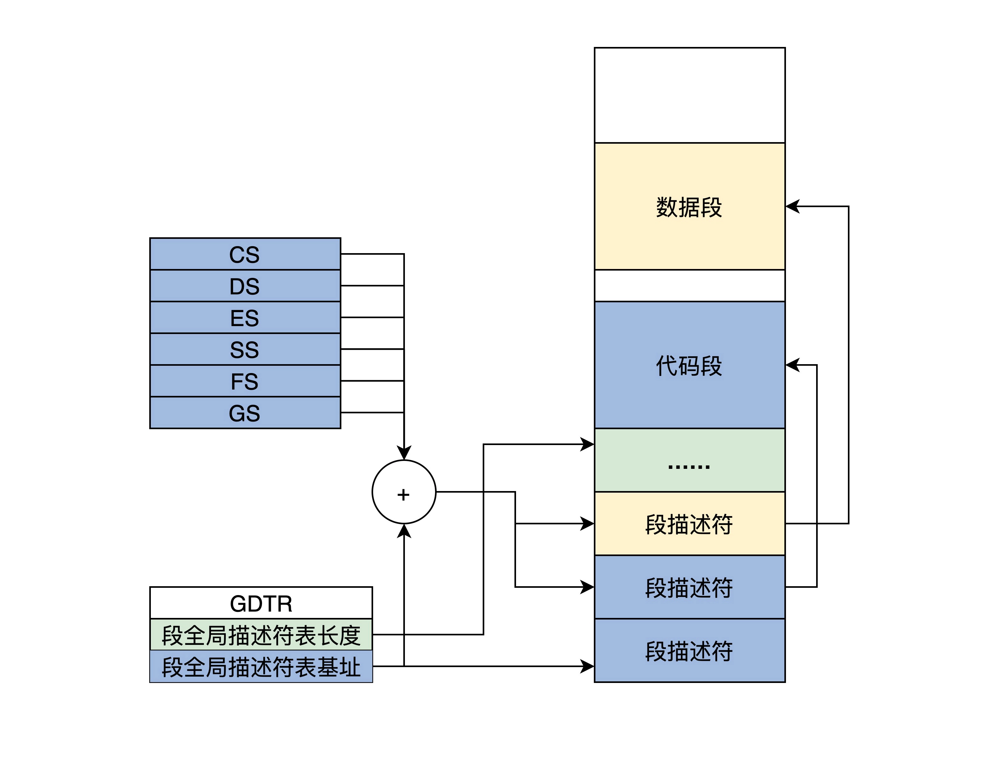

# 保护模式

[Protected mode](https://en.wikipedia.org/wiki/Protected_mode)起始于[Intel80286](https://en.wikipedia.org/wiki/Intel_80286)，但这还是一款16位的CPU，第一款**32位**的CPU是[Intel80386](https://en.wikipedia.org/wiki/I386)。『Linux内核Setup阶段』`arch/x86/boot/main.c`由实模式转为了保护模式。


## 寄存器

|寄存器|说明|
|---|---|
|EAX、EBX、ECX、EDX、ESI、EDI、EBP|32位通用寄存器|
|EIP|32位程序指针寄存器，始终指向下一条指令的地址|
|ESP|栈指针寄存器，始终指向当前栈顶|
|CS、DS、ES、SS、FS、GS|16位段寄存器，存放一个内存段的基地址|
|EFLAGS|32位CPU标志寄存器，存放CPU执行运算指令产生的状态位|
|CR0、CR1、CR2、CR3|32位CPU控制寄存器|

对比Intel8086，Intel80386的寄存器在原来的命名前面加了个『E』，也就是Extend（扩展）的意思，原来16位的扩展为了32位，而且低16位还可以兼容使用。


## 内存分段

要达到『保护』的目的，必须先得保存保护标识。寄存器数量是固定的，而且大小有限，所以在保护模式下引入了『段描述符』，由GDTR寄存器指向段描述符表。




段描述符(segment descriptor)包含的信息很丰富：
```
 63         56         51   48    45           39        32 
------------------------------------------------------------
|             | |B| |A|       | |   | |0|E|W|A|            |
| BASE 31:24  |G|/|L|V| LIMIT |P|DPL|S|  TYPE | BASE 23:16 |
|             | |D| |L| 19:16 | |   | |1|C|R|A|            |
------------------------------------------------------------

 31                         16 15                         0 
------------------------------------------------------------
|                             |                            |
|        BASE 15:0            |       LIMIT 15:0           |
|                             |                            |
------------------------------------------------------------
```

---
## 参考资料
1. 图片『全局段描述表』来自《操作系统实战45讲》 彭东
2. https://0xax.gitbooks.io/linux-insides/content/Booting/linux-bootstrap-2.html