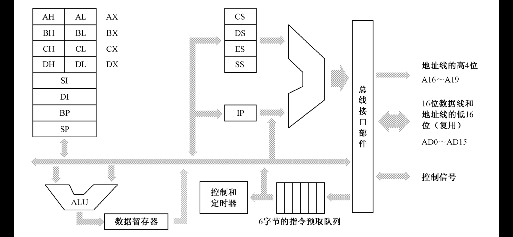
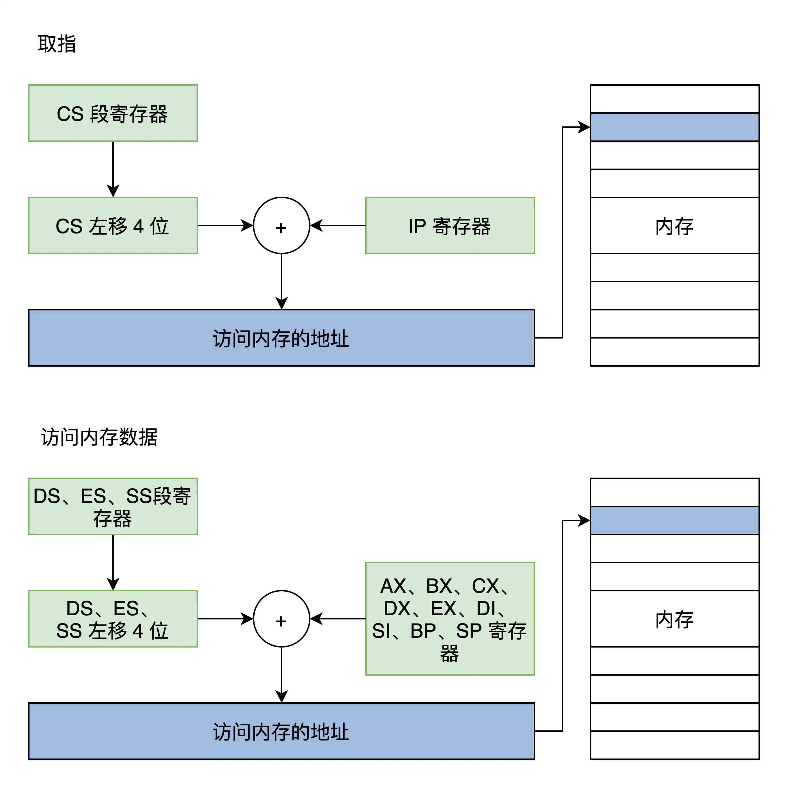

# 实模式

[Real mode](https://en.wikipedia.org/wiki/Real_mode)起始于[Intel8086](https://en.wikipedia.org/wiki/Intel_8086)，现在的『GRUB引导程序』和『Linux内核Setup阶段』工作在该模式下。Linux内核Setup阶段的代码位于`arch/x86/boot/`目录下。

8086是**16位**处理器，但是地址线有**20根**，支持最大的内存空间为1MB(2^20)。

## 寄存器

|寄存器|说明|
|---|---|
|AX、BX、CX、DX、SI、DI、BP|通用寄存器|
|IP|程序指针寄存器，始终指向下一条指令的地址|
|SP|栈指针寄存器，始终指向当前栈顶|
|CS、DS、ES、SS|段寄存器，存放一个内存段的基地址|
|FLAGS|CPU标志寄存器，存放CPU执行运算指令产生的状态位|

## 内存分段

---
## 参考资料
1. 图片『8086处理器内部组成框图』来自《x86汇编语言（第2版）》 李忠 王晓波 余洁 著
2. 图片『实模式下访问内存』来自《操作系统实战45讲》 彭东